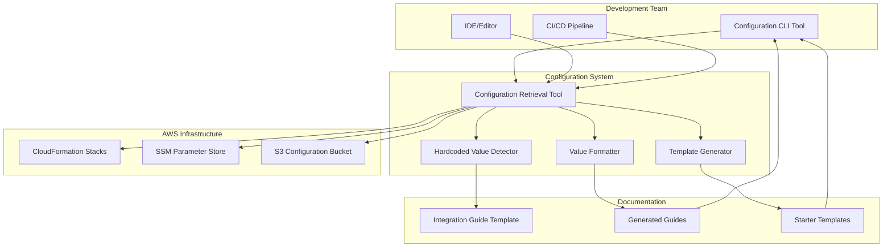

# Design Document

## Overview

This design document outlines a comprehensive system for streamlining configuration retrieval from deployed CloudFormation stacks and eliminating hardcoded values in the RAG Platform Integration Guide. The system provides development teams with easy-to-use tools for getting real configuration values while maintaining security best practices.

## Architecture

### High-Level Architecture



## Components and Interfaces

### 1. Configuration Retrieval Tool (CRT)

**Purpose**: Central orchestrator that queries AWS resources and coordinates other components.

**Interface**:
```typescript
interface ConfigurationRetrievalTool {
  // Main retrieval methods
  retrieveAllConfiguration(environment: string, options?: RetrievalOptions): Promise<ConfigurationData>;
  validateEnvironment(environment: string): Promise<ValidationResult>;
  detectAvailableEnvironments(): Promise<string[]>;
  
  // Caching methods
  getCachedConfiguration(environment: string): Promise<ConfigurationData | null>;
  updateCache(environment: string, data: ConfigurationData): Promise<void>;
  clearCache(environment?: string): Promise<void>;
}

interface RetrievalOptions {
  useCache?: boolean;
  cacheTimeout?: number;
  outputFormat?: OutputFormat[];
  validateValues?: boolean;
  includeMetadata?: boolean;
}

interface ConfigurationData {
  applicationName: string;
  environment: string;
  region: string;
  retrievalTimestamp: string;
  services: ServiceConfiguration;
  metadata?: ConfigurationMetadata;
}
```

### 2. Stack Query Service

**Purpose**: Handles all CloudFormation and AWS API interactions.

**Interface**:
```typescript
interface StackQueryService {
  // Stack operations
  findStacksByPattern(pattern: string, region: string): Promise<StackInfo[]>;
  getStackOutputs(stackName: string, region: string): Promise<StackOutput[]>;
  getStackExports(region: string): Promise<StackExport[]>;
  
  // SSM operations
  getParametersByPath(path: string, region: string): Promise<SSMParameter[]>;
  getParameter(name: string, region: string): Promise<string>;
  
  // S3 operations
  getConfigurationFile(bucket: string, key: string): Promise<any>;
  
  // Validation
  validateStackExists(stackName: string, region: string): Promise<boolean>;
  validateOutputExists(stackName: string, outputKey: string, region: string): Promise<boolean>;
}

interface StackInfo {
  stackName: string;
  stackStatus: string;
  creationTime: Date;
  lastUpdatedTime?: Date;
  outputs: StackOutput[];
}

interface StackOutput {
  outputKey: string;
  outputValue: string;
  description?: string;
  exportName?: string;
}
```

### 3. Value Formatter

**Purpose**: Converts retrieved configuration data into various output formats.

**Interface**:
```typescript
interface ValueFormatter {
  formatAsJSON(data: ConfigurationData): string;
  formatAsEnvFile(data: ConfigurationData): string;
  formatAsShellExports(data: ConfigurationData): string;
  formatAsYAML(data: ConfigurationData): string;
  formatForFramework(data: ConfigurationData, framework: Framework): string;
}

enum Framework {
  REACT = 'react',
  NODE_JS = 'nodejs',
  PYTHON = 'python',
  DOCKER_COMPOSE = 'docker-compose'
}

enum OutputFormat {
  JSON = 'json',
  ENV = 'env',
  SHELL = 'shell',
  YAML = 'yaml',
  REACT = 'react',
  NODEJS = 'nodejs',
  PYTHON = 'python'
}
```

### 4. Template Generator

**Purpose**: Creates starter templates with real configuration values embedded.

**Interface**:
```typescript
interface TemplateGenerator {
  generateLambdaTemplate(data: ConfigurationData, language: Language): Promise<TemplateResult>;
  generateFrontendTemplate(data: ConfigurationData, framework: Framework): Promise<TemplateResult>;
  generateDockerComposeTemplate(data: ConfigurationData): Promise<TemplateResult>;
  generateCDKTemplate(data: ConfigurationData, language: Language): Promise<TemplateResult>;
  
  listAvailableTemplates(): Promise<TemplateInfo[]>;
  generateCustomTemplate(templatePath: string, data: ConfigurationData): Promise<TemplateResult>;
}

interface TemplateResult {
  files: GeneratedFile[];
  instructions: string;
  dependencies: string[];
}

interface GeneratedFile {
  path: string;
  content: string;
  executable?: boolean;
}

enum Language {
  TYPESCRIPT = 'typescript',
  JAVASCRIPT = 'javascript',
  PYTHON = 'python',
  JAVA = 'java'
}
```

### 5. Hardcoded Value Detector

**Purpose**: Scans files for hardcoded values and suggests dynamic alternatives.

**Interface**:
```typescript
interface HardcodedValueDetector {
  scanFile(filePath: string): Promise<HardcodedValue[]>;
  scanDirectory(directoryPath: string, patterns?: string[]): Promise<ScanResult>;
  suggestReplacement(value: HardcodedValue): Promise<ReplacementSuggestion>;
  generateCleanTemplate(filePath: string): Promise<string>;
}

interface HardcodedValue {
  value: string;
  type: ValueType;
  location: FileLocation;
  confidence: number;
}

interface FileLocation {
  filePath: string;
  lineNumber: number;
  columnStart: number;
  columnEnd: number;
  context: string;
}

enum ValueType {
  ACCOUNT_ID = 'account_id',
  REGION = 'region',
  RESOURCE_NAME = 'resource_name',
  ARN = 'arn',
  ENDPOINT_URL = 'endpoint_url',
  BUCKET_NAME = 'bucket_name',
  USER_POOL_ID = 'user_pool_id',
  KNOWLEDGE_BASE_ID = 'knowledge_base_id'
}

interface ReplacementSuggestion {
  originalValue: string;
  replacementMethod: ReplacementMethod;
  code: string;
  description: string;
}

enum ReplacementMethod {
  CLOUDFORMATION_OUTPUT = 'cloudformation_output',
  SSM_PARAMETER = 'ssm_parameter',
  ENVIRONMENT_VARIABLE = 'environment_variable',
  CONFIGURATION_FILE = 'configuration_file'
}
```

## Data Models

### Configuration Data Structure

```typescript
interface ServiceConfiguration {
  bedrock: BedrockConfiguration;
  vectorDatabase: VectorDatabaseConfiguration;
  knowledgeBase: KnowledgeBaseConfiguration;
  authentication: AuthenticationConfiguration;
  storage: StorageConfiguration;
  textract: TextractConfiguration;
  database: DatabaseConfiguration;
  iam: IAMConfiguration;
  endpoints: EndpointConfiguration;
  monitoring: MonitoringConfiguration;
}

interface BedrockConfiguration {
  novaProModelId: string;
  embeddingModelId: string;
  region: string;
}

interface VectorDatabaseConfiguration {
  endpoint: string;
  indexName: string;
  collectionArn?: string;
}

interface KnowledgeBaseConfiguration {
  knowledgeBaseId: string;
  knowledgeBaseArn?: string;
  dataSourceId?: string;
}

interface AuthenticationConfiguration {
  userPoolId: string;
  clientId: string;
  identityPoolId: string;
  region: string;
}

interface StorageConfiguration {
  websiteBucket: string;
  documentBucket: string;
  configurationBucket: string;
  backupBucket: string;
  documentPartitions: DocumentPartitions;
  region: string;
}

interface DocumentPartitions {
  raw: string;
  processing: string;
  processed: string;
  failed: string;
  archive: string;
}

interface TextractConfiguration {
  region: string;
}

interface DatabaseConfiguration {
  dynamoDBRoleArn: string;
  dynamoDBRegion: string;
  tablePrefix: string;
}

interface IAMConfiguration {
  applicationRoleArn: string;
}

interface EndpointConfiguration {
  websiteUrl: string;
  apiGatewayUrl?: string;
}

interface MonitoringConfiguration {
  metricsNamespace: string;
}
```

## Correctness Properties

*A property is a characteristic or behavior that should hold true across all valid executions of a system-essentially, a formal statement about what the system should do. Properties serve as the bridge between human-readable specifications and machine-verifiable correctness guarantees.*

### Property Reflection

After analyzing the acceptance criteria, I identified several areas where properties could be consolidated:

- **Format Consistency Properties**: Properties 2.1-2.4 (JSON, .env, shell, framework formats) can be combined with Property 2.5 (format synchronization) into a comprehensive format consistency property
- **Resource Retrieval Properties**: Properties 4.1-4.6 (various AWS resource retrievals) can be combined into a single comprehensive resource retrieval property
- **Error Handling Properties**: Properties 7.1-7.3 (various error scenarios) can be combined into a comprehensive error handling property
- **Template Generation Properties**: Properties 6.1-6.4 (various template types) can be combined into a single template generation property
- **Hardcoded Value Detection Properties**: Properties 9.1-9.3 (scanning and detection) can be combined into a single detection property

### Core Properties

Property 1: Configuration Retrieval Consistency
*For any* valid environment and configuration request, the Configuration Retrieval Tool should successfully retrieve all available configuration values and provide consistent results across multiple invocations
**Validates: Requirements 1.1, 1.2, 1.3, 1.4**

Property 2: Multi-Format Output Consistency
*For any* valid configuration data, all output formats (JSON, .env, shell exports, framework snippets) should contain identical underlying values and remain synchronized
**Validates: Requirements 2.1, 2.2, 2.3, 2.4, 2.5**

Property 3: Environment Detection and Validation
*For any* AWS environment configuration, the tool should correctly detect available environments and validate that specified environments have the required RAG infrastructure stacks
**Validates: Requirements 3.1, 3.2, 3.3, 3.5**

Property 4: Comprehensive Resource Retrieval
*For any* deployed RAG infrastructure, the Stack Query Service should successfully retrieve all required resource identifiers (vector database endpoints, Cognito IDs, Bedrock Knowledge Base IDs, S3 bucket names, DynamoDB tables, IAM roles) when they exist
**Validates: Requirements 4.1, 4.2, 4.3, 4.4, 4.5, 4.6**

Property 5: Template Generation with Real Values
*For any* valid configuration data, the Template Generator should create syntactically correct templates for all supported frameworks (Lambda, frontend, Docker Compose, CDK) with real configuration values properly embedded and documented
**Validates: Requirements 6.1, 6.2, 6.3, 6.4, 6.5**

Property 6: Comprehensive Error Handling
*For any* error condition (missing stacks, permission failures, missing outputs, validation failures), the system should provide specific, actionable error messages that include all relevant details for resolution
**Validates: Requirements 7.1, 7.2, 7.3, 7.5**

Property 7: Format Validation
*For any* retrieved configuration value, the system should validate that it matches the expected format (URL, ARN, ID) and reject invalid values with specific guidance
**Validates: Requirements 7.4**

Property 8: CI/CD Integration Compatibility
*For any* CI/CD environment, the tool should provide machine-readable output and support automated configuration retrieval without user interaction
**Validates: Requirements 8.2, 8.3**

Property 9: Configuration Caching Consistency
*For any* configuration data, caching should reduce AWS API calls while maintaining data consistency, and cache invalidation should work correctly when infrastructure changes
**Validates: Requirements 8.4, 8.5**

Property 10: Hardcoded Value Detection and Replacement
*For any* documentation or configuration file, the system should detect all hardcoded AWS resource identifiers and provide appropriate suggestions for dynamic retrieval methods
**Validates: Requirements 9.1, 9.2, 9.3**

Property 11: Clean Template Generation
*For any* generated template or documentation, the output should contain no hardcoded resource identifiers and use only placeholder variables or dynamic retrieval methods
**Validates: Requirements 9.4, 9.5**

## Error Handling

### Error Categories

1. **AWS API Errors**
   - CloudFormation stack not found
   - SSM parameter not found
   - S3 bucket access denied
   - Invalid AWS credentials
   - Region not supported

2. **Configuration Errors**
   - Missing required stack outputs
   - Invalid configuration format
   - Inconsistent environment setup
   - Missing environment variables

3. **Validation Errors**
   - Invalid resource identifier format
   - Unreachable endpoints
   - Expired credentials
   - Insufficient permissions

4. **System Errors**
   - Network connectivity issues
   - File system permissions
   - Cache corruption
   - Template generation failures

### Error Handling Strategy

```typescript
interface ErrorHandler {
  handleAWSError(error: AWSError): ErrorResponse;
  handleConfigurationError(error: ConfigurationError): ErrorResponse;
  handleValidationError(error: ValidationError): ErrorResponse;
  handleSystemError(error: SystemError): ErrorResponse;
}

interface ErrorResponse {
  errorCode: string;
  message: string;
  details: string;
  suggestions: string[];
  retryable: boolean;
  documentationUrl?: string;
}

// Example error responses
const STACK_NOT_FOUND_ERROR: ErrorResponse = {
  errorCode: 'STACK_NOT_FOUND',
  message: 'CloudFormation stack not found',
  details: 'Stack "rag-app-v2-vector-db-dev" was not found in region us-east-1',
  suggestions: [
    'Verify the stack name follows the expected pattern: {app}-{service}-{env}',
    'Check that the infrastructure has been deployed to the specified environment',
    'Confirm you are using the correct AWS region and account',
    'Run "aws cloudformation list-stacks" to see available stacks'
  ],
  retryable: false,
  documentationUrl: 'https://docs.aws.amazon.com/cloudformation/latest/userguide/troubleshooting.html'
};
```

## Testing Strategy

### Dual Testing Approach

The system will use both unit testing and property-based testing to ensure comprehensive coverage:

- **Unit tests**: Verify specific examples, edge cases, and error conditions
- **Property tests**: Verify universal properties across all inputs
- Both are complementary and necessary for comprehensive coverage

### Property-Based Testing Configuration

- **Testing Library**: fast-check for TypeScript/JavaScript implementation
- **Minimum Iterations**: 100 iterations per property test
- **Test Tags**: Each property test must reference its design document property
- **Tag Format**: **Feature: dynamic-integration-guide, Property {number}: {property_text}**

### Unit Testing Focus

Unit tests should focus on:
- Specific examples that demonstrate correct behavior
- Integration points between components
- Edge cases and error conditions
- AWS API mocking and response handling

### Property Testing Focus

Property tests should focus on:
- Universal properties that hold for all inputs
- Comprehensive input coverage through randomization
- Format consistency across different output types
- Error handling consistency across different failure scenarios

### Test Data Generation

```typescript
// Example property test generators
const generateConfigurationData = (): ConfigurationData => ({
  applicationName: fc.string({ minLength: 3, maxLength: 20 }),
  environment: fc.oneof(fc.constant('dev'), fc.constant('staging'), fc.constant('prod')),
  region: fc.oneof(fc.constant('us-east-1'), fc.constant('us-west-2'), fc.constant('eu-west-1')),
  services: generateServiceConfiguration()
});

const generateServiceConfiguration = (): ServiceConfiguration => ({
  bedrock: {
    novaProModelId: fc.constant('amazon.nova-pro-v1:0'),
    embeddingModelId: fc.constant('amazon.titan-embed-text-v1'),
    region: fc.string()
  },
  vectorDatabase: {
    endpoint: fc.webUrl(),
    indexName: fc.string({ minLength: 1, maxLength: 50 })
  },
  // ... other service configurations
});
```

## Implementation Phases

### Phase 1: Core Configuration Retrieval
- Implement Configuration Retrieval Tool
- Implement Stack Query Service
- Basic CloudFormation and SSM integration
- Simple JSON output format

### Phase 2: Multiple Output Formats
- Implement Value Formatter
- Add support for .env, shell exports, YAML formats
- Framework-specific configuration snippets
- Output format validation

### Phase 3: Template Generation
- Implement Template Generator
- Create starter templates for Lambda, frontend, Docker Compose
- Template validation and testing
- Documentation generation

### Phase 4: Hardcoded Value Detection
- Implement Hardcoded Value Detector
- File scanning and pattern recognition
- Replacement suggestion engine
- Integration with existing documentation

### Phase 5: Advanced Features
- Configuration caching
- CI/CD integration
- Advanced error handling
- Performance optimization

## Security Considerations

### Credential Management
- Use AWS SDK default credential chain
- Support for AWS profiles and roles
- No credential storage in configuration files
- Secure handling of temporary credentials

### Data Protection
- No sensitive data in logs
- Secure transmission of configuration data
- Proper handling of IAM role ARNs and resource identifiers
- Cache encryption for sensitive configuration data

### Access Control
- Least-privilege IAM permissions for stack queries
- Region-specific access controls
- Environment-based access restrictions
- Audit logging for configuration retrieval

## Performance Considerations

### Caching Strategy
- Local file-based cache for configuration data
- TTL-based cache expiration
- Cache invalidation on infrastructure changes
- Parallel retrieval for multiple resources

### API Optimization
- Batch CloudFormation API calls where possible
- Connection pooling for AWS SDK clients
- Retry logic with exponential backoff
- Rate limiting to avoid API throttling

### Scalability
- Support for multiple AWS accounts and regions
- Concurrent processing of multiple environments
- Efficient memory usage for large configuration sets
- Streaming output for large template generation

<function_calls>
<invoke name="prework">
<parameter name="featureName">dynamic-integration-guide