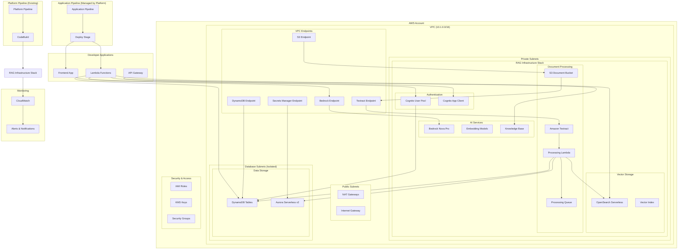

# Design Document: RAG Application Infrastructure

## Overview

This design document outlines the architecture and implementation approach for RAG (Retrieval-Augmented Generation) application infrastructure that will be deployed and managed by the platform team. The infrastructure provides foundational AI/ML services, particularly AWS Bedrock Nova Pro, vector databases, and supporting services that application developers can use to build RAG applications.

**Prerequisites**: This design assumes that the platform CodePipeline infrastructure is already deployed and functional, as defined in the platform pipeline architecture. 

**Deployment Strategy**: The RAG application infrastructure follows a two-phase deployment approach:
1. **Initial Bootstrap**: Deploy the RAG infrastructure stack locally using `cdk deploy` to establish the initial resources
2. **Pipeline Management**: Once deployed, all future updates will be managed through the existing platform pipeline system when changes are pushed to the repository

This approach allows the platform team to establish the infrastructure initially without requiring repository access, while ensuring all subsequent changes go through the controlled pipeline process.

The solution leverages AWS CDK with TypeScript to deploy a comprehensive AI infrastructure stack that integrates seamlessly with the existing platform pipeline architecture. The infrastructure is designed to support multiple environments (dev, staging, prod) and provides secure, scalable access to AI services for application developers building frontend applications and Lambda-based APIs.

## Architecture

### High-Level Architecture



### Component Architecture

The RAG infrastructure consists of several key components:

1. **Network Infrastructure**: Multi-AZ VPC with public/private subnets and VPC endpoints
2. **Bedrock AI Services**: Nova Pro foundation model and embedding models
3. **Vector Database**: OpenSearch Serverless for vector storage and similarity search
4. **Knowledge Base Management**: AWS Bedrock Knowledge Base service
5. **Document Processing Pipeline**: S3, Textract, Lambda, and SQS for automated document processing
6. **Data Storage**: DynamoDB tables and Aurora Serverless v2 for application data
7. **Authentication Services**: Cognito User Pool for user authentication
8. **S3 Storage Infrastructure**: Multiple buckets for website, documents, configuration, and backup
9. **Security Layer**: IAM roles, KMS encryption, security groups, and VPC endpoints
10. **Integration Layer**: Environment-specific configuration for application pipeline integration
11. **Configuration Export**: Shared configuration file for development teams

## Components and Interfaces

### Bootstrap-to-Pipeline Transition Strategy

The RAG infrastructure is designed to support a seamless transition from local bootstrap deployment to pipeline-managed updates:

**Initial Bootstrap Phase:**
```typescript
// Local deployment command
cdk deploy RAGInfrastructureStack --profile platform-admin

// Stack configuration for bootstrap
export class RAGInfrastructureStack extends Stack {
  constructor(scope: Construct, id: string, props: StackProps) {
    super(scope, id, {
      ...props,
      // Ensure stack can be adopted by pipeline later
      stackName: `rag-infrastructure-${props.environment}`,
      tags: {
        ManagedBy: 'PlatformPipeline',
        Environment: props.environment,
        Application: 'RAGInfrastructure',
      },
    });
  }
}
```

**Pipeline Management Phase:**
Once the platform pipeline is configured to manage the RAG infrastructure:
1. The existing stack resources remain unchanged
2. Pipeline deployments use the same stack name and configuration
3. CDK automatically detects existing resources and manages them
4. No resource recreation or downtime occurs during transition

**Key Design Principles:**
- Stack names and resource IDs are consistent between bootstrap and pipeline deployments
- All resources use deterministic naming patterns
- Stack tags indicate pipeline management intent
- Environment-specific configurations support both deployment methods

### Bedrock AI Services Stack

The core AI services component that provides access to foundation models and embedding capabilities.

**Key Responsibilities:**
- Deploy and configure Bedrock Nova Pro model access
- Set up embedding models for document processing
- Configure model access permissions and quotas
- Provide cross-region model availability

**CDK Implementation:**
```typescript
export class BedrockAIServicesConstruct extends Construct {
  public readonly novaProModelId: string;
  public readonly embeddingModelId: string;
  
  constructor(scope: Construct, id: string, props: BedrockAIServicesProps) {
    super(scope, id);
    
    // Enable Bedrock Nova Pro model access
    this.novaProModelId = BedrockFoundationModel.AMAZON_NOVA_PRO_V1.modelId;
    
    // Configure embedding model for document processing
    this.embeddingModelId = BedrockFoundationModel.AMAZON_TITAN_EMBED_TEXT_V1.modelId;
    
    // Create IAM policies for model access
    this.createModelAccessPolicies(props);
  }
  
  private createModelAccessPolicies(props: BedrockAIServicesProps): void {
    // Implementation for IAM policies
  }
}
```

### Vector Database Infrastructure

Manages the vector storage and similarity search capabilities using Amazon OpenSearch Serverless.

**Key Features:**
- OpenSearch Serverless collection for cost-effective vector storage
- Automated index creation and management
- High-performance similarity search capabilities
- Backup and disaster recovery configuration

**Interface:**
```typescript
export interface VectorDatabaseConfig {
  readonly collectionName: string;
  readonly indexName: string;
  readonly vectorDimensions: number;
  readonly encryptionConfig?: {
    readonly kmsKeyId: string;
  };
  readonly backupConfig?: {
    readonly retentionDays: number;
    readonly crossRegionReplication: boolean;
  };
}

export class VectorDatabaseConstruct extends Construct {
  public readonly collection: opensearchserverless.CfnCollection;
  public readonly collectionArn: string;
  
  constructor(scope: Construct, id: string, config: VectorDatabaseConfig) {
    // Implementation creates OpenSearch Serverless collection
    // and configures vector index
  }
}
```

### Knowledge Base Management Service

Integrates AWS Bedrock Knowledge Base with the vector database for document management and retrieval.

**Key Features:**
- Bedrock Knowledge Base integration with OpenSearch Serverless
- Automated document synchronization and indexing
- Query and retrieval API endpoints
- Version management and updates

**CDK Implementation:**
```typescript
export class KnowledgeBaseConstruct extends Construct {
  public readonly knowledgeBase: bedrock.CfnKnowledgeBase;
  public readonly dataSource: bedrock.CfnDataSource;
  
  constructor(scope: Construct, id: string, props: KnowledgeBaseProps) {
    super(scope, id);
    
    // Create Bedrock Knowledge Base
    this.knowledgeBase = new bedrock.CfnKnowledgeBase(this, 'KnowledgeBase', {
      name: props.knowledgeBaseName,
      description: 'RAG application knowledge base',
      knowledgeBaseConfiguration: {
        type: 'VECTOR',
        vectorKnowledgeBaseConfiguration: {
          embeddingModelArn: props.embeddingModelArn,
        },
      },
      storageConfiguration: {
        type: 'OPENSEARCH_SERVERLESS',
        opensearchServerlessConfiguration: {
          collectionArn: props.vectorDatabase.collectionArn,
          vectorIndexName: props.vectorDatabase.indexName,
          fieldMapping: {
            vectorField: 'vector',
            textField: 'text',
            metadataField: 'metadata',
          },
        },
      },
      roleArn: props.serviceRole.roleArn,
    });
  }
}
```

### Network Infrastructure

Comprehensive VPC architecture for secure, scalable SaaS RAG application deployment.

**Key Components:**
- Multi-AZ VPC with public and private subnets
- VPC endpoints for AWS services (Bedrock, S3, DynamoDB)
- Security groups for service-to-service communication
- NAT Gateways for outbound internet access from private subnets

**Network Architecture:**
```typescript
export class NetworkInfrastructure extends Construct {
  public readonly vpc: ec2.Vpc;
  public readonly privateSubnets: ec2.ISubnet[];
  public readonly publicSubnets: ec2.ISubnet[];
  public readonly vpcEndpoints: { [service: string]: ec2.VpcEndpoint };
  public readonly securityGroups: { [name: string]: ec2.SecurityGroup };
  
  constructor(scope: Construct, id: string, props: NetworkInfrastructureProps) {
    super(scope, id);
    
    // Create VPC with public and private subnets across multiple AZs
    this.vpc = new ec2.Vpc(this, 'RAGApplicationVPC', {
      vpcName: `${props.applicationName}-vpc-${props.environment}`,
      cidr: '10.1.0.0/16',
      maxAzs: 3, // Use 3 AZs for high availability
      enableDnsHostnames: true,
      enableDnsSupport: true,
      subnetConfiguration: [
        {
          name: 'Public',
          subnetType: ec2.SubnetType.PUBLIC,
          cidrMask: 24, // 10.1.1.0/24, 10.1.2.0/24, 10.1.3.0/24
        },
        {
          name: 'Private',
          subnetType: ec2.SubnetType.PRIVATE_WITH_EGRESS,
          cidrMask: 24, // 10.1.11.0/24, 10.1.12.0/24, 10.1.13.0/24
        },
        {
          name: 'Database',
          subnetType: ec2.SubnetType.PRIVATE_ISOLATED,
          cidrMask: 24, // 10.1.21.0/24, 10.1.22.0/24, 10.1.23.0/24
        },
      ],
      natGateways: props.environment === 'prod' ? 3 : 1, // HA for prod, cost-optimized for dev
    });
    
    this.privateSubnets = this.vpc.privateSubnets;
    this.publicSubnets = this.vpc.publicSubnets;
    
    // Create VPC endpoints for AWS services to avoid internet routing
    this.vpcEndpoints = this.createVpcEndpoints();
    
    // Create security groups for different service tiers
    this.securityGroups = this.createSecurityGroups();
  }
  
  private createVpcEndpoints(): { [service: string]: ec2.VpcEndpoint } {
    const endpoints: { [service: string]: ec2.VpcEndpoint } = {};
    
    // S3 Gateway endpoint (no cost)
    endpoints.s3 = new ec2.GatewayVpcEndpoint(this, 'S3Endpoint', {
      vpc: this.vpc,
      service: ec2.GatewayVpcEndpointAwsService.S3,
      subnets: [{ subnetType: ec2.SubnetType.PRIVATE_WITH_EGRESS }],
    });
    
    // DynamoDB Gateway endpoint (no cost)
    endpoints.dynamodb = new ec2.GatewayVpcEndpoint(this, 'DynamoDBEndpoint', {
      vpc: this.vpc,
      service: ec2.GatewayVpcEndpointAwsService.DYNAMODB,
      subnets: [{ subnetType: ec2.SubnetType.PRIVATE_WITH_EGRESS }],
    });
    
    // Bedrock Interface endpoint
    endpoints.bedrock = new ec2.InterfaceVpcEndpoint(this, 'BedrockEndpoint', {
      vpc: this.vpc,
      service: new ec2.InterfaceVpcEndpointService(`com.amazonaws.${this.region}.bedrock-runtime`),
      subnets: { subnetType: ec2.SubnetType.PRIVATE_WITH_EGRESS },
      privateDnsEnabled: true,
    });
    
    // Textract Interface endpoint
    endpoints.textract = new ec2.InterfaceVpcEndpoint(this, 'TextractEndpoint', {
      vpc: this.vpc,
      service: new ec2.InterfaceVpcEndpointService(`com.amazonaws.${this.region}.textract`),
      subnets: { subnetType: ec2.SubnetType.PRIVATE_WITH_EGRESS },
      privateDnsEnabled: true,
    });
    
    // Secrets Manager endpoint for Aurora credentials
    endpoints.secretsmanager = new ec2.InterfaceVpcEndpoint(this, 'SecretsManagerEndpoint', {
      vpc: this.vpc,
      service: ec2.InterfaceVpcEndpointAwsService.SECRETS_MANAGER,
      subnets: { subnetType: ec2.SubnetType.PRIVATE_WITH_EGRESS },
      privateDnsEnabled: true,
    });
    
    return endpoints;
  }
  
  private createSecurityGroups(): { [name: string]: ec2.SecurityGroup } {
    const securityGroups: { [name: string]: ec2.SecurityGroup } = {};
    
    // Lambda security group
    securityGroups.lambda = new ec2.SecurityGroup(this, 'LambdaSecurityGroup', {
      vpc: this.vpc,
      description: 'Security group for Lambda functions',
      allowAllOutbound: true, // Lambda needs outbound access to AWS services
    });
    
    // Aurora security group
    securityGroups.aurora = new ec2.SecurityGroup(this, 'AuroraSecurityGroup', {
      vpc: this.vpc,
      description: 'Security group for Aurora Serverless cluster',
      allowAllOutbound: false,
    });
    
    // Allow Lambda to connect to Aurora on PostgreSQL port
    securityGroups.aurora.addIngressRule(
      securityGroups.lambda,
      ec2.Port.tcp(5432),
      'Allow Lambda access to Aurora PostgreSQL'
    );
    
    // OpenSearch Serverless security group (if using VPC mode)
    securityGroups.opensearch = new ec2.SecurityGroup(this, 'OpenSearchSecurityGroup', {
      vpc: this.vpc,
      description: 'Security group for OpenSearch Serverless',
      allowAllOutbound: false,
    });
    
    // Allow Lambda to connect to OpenSearch on HTTPS
    securityGroups.opensearch.addIngressRule(
      securityGroups.lambda,
      ec2.Port.tcp(443),
      'Allow Lambda access to OpenSearch'
    );
    
    // VPC Endpoint security group
    securityGroups.vpcEndpoints = new ec2.SecurityGroup(this, 'VPCEndpointsSecurityGroup', {
      vpc: this.vpc,
      description: 'Security group for VPC endpoints',
      allowAllOutbound: false,
    });
    
    // Allow Lambda to access VPC endpoints on HTTPS
    securityGroups.vpcEndpoints.addIngressRule(
      securityGroups.lambda,
      ec2.Port.tcp(443),
      'Allow Lambda access to VPC endpoints'
    );
    
    return securityGroups;
  }
  
  public getNetworkConfiguration(): NetworkConfiguration {
    return {
      vpcId: this.vpc.vpcId,
      privateSubnetIds: this.privateSubnets.map(subnet => subnet.subnetId),
      publicSubnetIds: this.publicSubnets.map(subnet => subnet.subnetId),
      securityGroupIds: {
        lambda: this.securityGroups.lambda.securityGroupId,
        aurora: this.securityGroups.aurora.securityGroupId,
        opensearch: this.securityGroups.opensearch.securityGroupId,
        vpcEndpoints: this.securityGroups.vpcEndpoints.securityGroupId,
      },
      vpcEndpoints: Object.keys(this.vpcEndpoints),
    };
  }
}

interface NetworkConfiguration {
  vpcId: string;
  privateSubnetIds: string[];
  publicSubnetIds: string[];
  securityGroupIds: {
    lambda: string;
    aurora: string;
    opensearch: string;
    vpcEndpoints: string;
  };
  vpcEndpoints: string[];
}
```

### S3 Storage Infrastructure

Comprehensive S3 bucket strategy for the RAG application with different buckets for different purposes.

**Key Components:**
- Website hosting bucket for frontend application
- Document storage bucket with partitioning for raw and processed documents
- Configuration export bucket for development team handoff
- Backup bucket for disaster recovery

**S3 Infrastructure Implementation:**
```typescript
export class S3StorageConstruct extends Construct {
  public readonly websiteBucket: s3.Bucket;
  public readonly documentBucket: s3.Bucket;
  public readonly configurationBucket: s3.Bucket;
  public readonly backupBucket: s3.Bucket;
  
  constructor(scope: Construct, id: string, props: S3StorageProps) {
    super(scope, id);
    
    // Website hosting bucket for frontend application
    this.websiteBucket = new s3.Bucket(this, 'WebsiteBucket', {
      bucketName: `${props.applicationName}-website-${props.environment}`,
      websiteIndexDocument: 'index.html',
      websiteErrorDocument: 'error.html',
      publicReadAccess: true,
      blockPublicAccess: s3.BlockPublicAccess.BLOCK_ACLS,
      encryption: s3.BucketEncryption.S3_MANAGED,
      removalPolicy: RemovalPolicy.DESTROY, // For non-prod environments
    });
    
    // Document storage bucket with partitioning
    this.documentBucket = new s3.Bucket(this, 'DocumentBucket', {
      bucketName: `${props.applicationName}-documents-${props.environment}`,
      encryption: s3.BucketEncryption.KMS,
      versioned: true,
      lifecycleRules: [
        {
          id: 'DeleteOldVersions',
          expiration: Duration.days(90),
        },
        {
          id: 'TransitionToIA',
          transitions: [{
            storageClass: s3.StorageClass.INFREQUENT_ACCESS,
            transitionAfter: Duration.days(30),
          }],
        },
        {
          id: 'ArchiveProcessedDocuments',
          prefix: 'processed/',
          transitions: [{
            storageClass: s3.StorageClass.GLACIER,
            transitionAfter: Duration.days(90),
          }],
        },
      ],
      cors: [{
        allowedMethods: [s3.HttpMethods.GET, s3.HttpMethods.POST, s3.HttpMethods.PUT],
        allowedOrigins: props.allowedOrigins || ['*'],
        allowedHeaders: ['*'],
        maxAge: 3000,
      }],
    });
    
    // Configuration export bucket for development teams
    this.configurationBucket = new s3.Bucket(this, 'ConfigurationBucket', {
      bucketName: `${props.applicationName}-config-${props.environment}`,
      encryption: s3.BucketEncryption.KMS,
      versioned: true,
      publicReadAccess: false,
      blockPublicAccess: s3.BlockPublicAccess.BLOCK_ALL,
    });
    
    // Backup bucket for disaster recovery
    this.backupBucket = new s3.Bucket(this, 'BackupBucket', {
      bucketName: `${props.applicationName}-backup-${props.environment}`,
      encryption: s3.BucketEncryption.KMS,
      versioned: true,
      lifecycleRules: [{
        id: 'TransitionToGlacier',
        transitions: [{
          storageClass: s3.StorageClass.GLACIER,
          transitionAfter: Duration.days(30),
        }],
      }],
    });
    
    // Set up cross-region replication for backup bucket (if multi-region)
    if (props.enableCrossRegionReplication) {
      const replicationRole = new iam.Role(this, 'ReplicationRole', {
        assumedBy: new iam.ServicePrincipal('s3.amazonaws.com'),
        managedPolicies: [
          iam.ManagedPolicy.fromAwsManagedPolicyName('service-role/AWSS3ReplicationServiceRolePolicy'),
        ],
      });
      
      // Add replication configuration (would need additional setup for destination bucket)
    }
  }
  
  public getDocumentPartitionPrefixes(): { [key: string]: string } {
    return {
      raw: 'raw/',
      processing: 'processing/',
      processed: 'processed/',
      failed: 'failed/',
      archive: 'archive/',
    };
  }
}
```

### Document Processing Pipeline

Automated pipeline for processing documents using Amazon Textract and generating embeddings.

**Key Components:**
- S3 bucket for document uploads
- Amazon Textract for text extraction from various document formats
- Lambda function for orchestrating processing and embedding generation
- SQS queue for processing coordination
- Integration with embedding models

**Processing Workflow:**
```typescript
export class DocumentProcessingConstruct extends Construct {
  public readonly processingFunction: lambda.Function;
  public readonly processingQueue: sqs.Queue;
  public readonly textractRole: iam.Role;
  
  constructor(scope: Construct, id: string, props: DocumentProcessingProps) {
    super(scope, id);
    
    // Use the document bucket from S3 storage construct
    const documentBucket = props.s3Storage.documentBucket;
    const partitionPrefixes = props.s3Storage.getDocumentPartitionPrefixes();
    
    // Create processing queue
    this.processingQueue = new sqs.Queue(this, 'ProcessingQueue', {
      queueName: `${props.applicationName}-processing-${props.environment}`,
      visibilityTimeout: Duration.minutes(15),
      deadLetterQueue: {
        queue: new sqs.Queue(this, 'ProcessingDLQ'),
        maxReceiveCount: 3,
      },
    });
    
    // Create IAM role for Textract access
    this.textractRole = new iam.Role(this, 'TextractRole', {
      assumedBy: new iam.ServicePrincipal('lambda.amazonaws.com'),
      managedPolicies: [
        iam.ManagedPolicy.fromAwsManagedPolicyName('service-role/AWSLambdaBasicExecutionRole'),
        iam.ManagedPolicy.fromAwsManagedPolicyName('AmazonTextractFullAccess'),
      ],
    });
    
    // Create document processing Lambda
    this.processingFunction = new lambda.Function(this, 'ProcessingFunction', {
      runtime: lambda.Runtime.PYTHON_3_11,
      handler: 'index.handler',
      code: lambda.Code.fromAsset('lambda/document-processing'),
      timeout: Duration.minutes(15),
      memorySize: 1024,
      role: this.textractRole,
      environment: {
        BEDROCK_EMBEDDING_MODEL_ID: props.embeddingModelId,
        VECTOR_COLLECTION_ENDPOINT: props.vectorDatabase.collectionEndpoint,
        KNOWLEDGE_BASE_ID: props.knowledgeBase.knowledgeBaseId,
        TEXTRACT_ROLE_ARN: this.textractRole.roleArn,
        DOCUMENT_BUCKET: documentBucket.bucketName,
        RAW_PREFIX: partitionPrefixes.raw,
        PROCESSING_PREFIX: partitionPrefixes.processing,
        PROCESSED_PREFIX: partitionPrefixes.processed,
        FAILED_PREFIX: partitionPrefixes.failed,
      },
    });
    
    // Grant S3 access to Lambda for all partitions
    documentBucket.grantReadWrite(this.processingFunction);
    
    // Configure S3 event trigger only for raw documents
    documentBucket.addEventNotification(
      s3.EventType.OBJECT_CREATED,
      new s3n.SqsDestination(this.processingQueue),
      { prefix: partitionPrefixes.raw }
    );
    
    // Configure SQS trigger for Lambda
    this.processingFunction.addEventSource(
      new lambdaEventSources.SqsEventSource(this.processingQueue, {
        batchSize: 1,
      })
    );
  }
}
}
```

### Application Integration Layer

Provides seamless integration with application pipeline deployments and developer applications.

**Key Features:**
- Environment-specific IAM roles for application access
- Configuration management for different environments
- SDK libraries and example code for developers
- Integration with API Gateway and Lambda functions

**Integration Configuration:**
```typescript
export class ApplicationIntegrationConstruct extends Construct {
  public readonly applicationRole: iam.Role;
  public readonly configurationParameters: ssm.StringParameter[];
  
  constructor(scope: Construct, id: string, props: ApplicationIntegrationProps) {
    super(scope, id);
    
    // Create IAM role for application Lambda functions
    this.applicationRole = new iam.Role(this, 'ApplicationRole', {
      roleName: `${props.applicationName}-rag-role-${props.environment}`,
      assumedBy: new iam.ServicePrincipal('lambda.amazonaws.com'),
      managedPolicies: [
        iam.ManagedPolicy.fromAwsManagedPolicyName('service-role/AWSLambdaBasicExecutionRole'),
      ],
    });
    
    // Grant Bedrock access
    this.applicationRole.addToPolicy(new iam.PolicyStatement({
      effect: iam.Effect.ALLOW,
      actions: [
        'bedrock:InvokeModel',
        'bedrock:InvokeModelWithResponseStream',
      ],
      resources: [
        `arn:aws:bedrock:${props.region}::foundation-model/${props.novaProModelId}`,
      ],
    }));
    
    // Grant Knowledge Base access
    this.applicationRole.addToPolicy(new iam.PolicyStatement({
      effect: iam.Effect.ALLOW,
      actions: [
        'bedrock:Retrieve',
        'bedrock:RetrieveAndGenerate',
      ],
      resources: [props.knowledgeBase.knowledgeBaseArn],
    }));
    
    // Grant Textract access
    this.applicationRole.addToPolicy(new iam.PolicyStatement({
      effect: iam.Effect.ALLOW,
      actions: [
        'textract:DetectDocumentText',
        'textract:AnalyzeDocument',
      ],
      resources: ['*'],
    }));
    
    // Create configuration parameters for applications
    this.configurationParameters = [
      new ssm.StringParameter(this, 'BedrockModelId', {
        parameterName: `/${props.applicationName}/${props.environment}/bedrock/nova-pro-model-id`,
        stringValue: props.novaProModelId,
      }),
      new ssm.StringParameter(this, 'KnowledgeBaseId', {
        parameterName: `/${props.applicationName}/${props.environment}/bedrock/knowledge-base-id`,
        stringValue: props.knowledgeBase.knowledgeBaseId,
      }),
    ];
  }
}
```

### Data Storage Infrastructure

Database infrastructure provisioning for SaaS RAG application, allowing application teams to define their own schemas and data models.

**Key Components:**
- DynamoDB provisioned capacity and IAM access
- Optional Aurora PostgreSQL Serverless v2 for complex analytics
- Database monitoring and backup configuration
- Access patterns and permissions for application teams

**Benefits of Aurora Serverless v2:**
- **Auto-scaling**: Automatically scales compute capacity based on demand (0.5-16 ACUs)
- **Cost-effective**: Pay only for the compute capacity used, scales to zero when idle
- **High availability**: Multi-AZ deployment with automatic failover
- **Performance**: Consistent performance with instant scaling
- **Compatibility**: Full PostgreSQL compatibility for complex analytics queries

**Data Storage Implementation:**
```typescript
export class DataStorageConstruct extends Construct {
  public readonly dynamoDBRole: iam.Role;
  public readonly rdsInstance?: rds.DatabaseInstance;
  public readonly databaseEndpoints: { [key: string]: string };
  
  constructor(scope: Construct, id: string, props: DataStorageProps) {
    super(scope, id);
    
    // Create IAM role for DynamoDB access (application teams will create their own tables)
    this.dynamoDBRole = new iam.Role(this, 'DynamoDBRole', {
      roleName: `${props.applicationName}-dynamodb-role-${props.environment}`,
      assumedBy: new iam.ServicePrincipal('lambda.amazonaws.com'),
      managedPolicies: [
        iam.ManagedPolicy.fromAwsManagedPolicyName('service-role/AWSLambdaBasicExecutionRole'),
      ],
    });
    
    // Grant DynamoDB permissions (application teams will specify table names)
    this.dynamoDBRole.addToPolicy(new iam.PolicyStatement({
      effect: iam.Effect.ALLOW,
      actions: [
        'dynamodb:GetItem',
        'dynamodb:PutItem',
        'dynamodb:UpdateItem',
        'dynamodb:DeleteItem',
        'dynamodb:Query',
        'dynamodb:Scan',
        'dynamodb:BatchGetItem',
        'dynamodb:BatchWriteItem',
      ],
      resources: [
        `arn:aws:dynamodb:${props.region}:${props.account}:table/${props.applicationName}-*`,
      ],
    }));
    
    // Optional Aurora PostgreSQL Serverless for complex analytics
    if (props.enableRDS) {
      const dbSubnetGroup = new rds.SubnetGroup(this, 'DBSubnetGroup', {
        description: 'Subnet group for Aurora Serverless cluster',
        vpc: props.vpc,
        vpcSubnets: {
          subnetType: ec2.SubnetType.PRIVATE_WITH_EGRESS,
        },
      });
      
      // Create Aurora PostgreSQL Serverless v2 cluster
      const auroraCluster = new rds.DatabaseCluster(this, 'AuroraServerlessCluster', {
        engine: rds.DatabaseClusterEngine.auroraPostgres({
          version: rds.AuroraPostgresEngineVersion.VER_15_4,
        }),
        credentials: rds.Credentials.fromGeneratedSecret('dbadmin'),
        vpc: props.vpc,
        subnetGroup: dbSubnetGroup,
        serverlessV2MinCapacity: 0.5, // Minimum ACUs (Aurora Capacity Units)
        serverlessV2MaxCapacity: 16,  // Maximum ACUs
        defaultDatabaseName: 'analytics',
        storageEncrypted: true,
        backupRetention: Duration.days(7),
        deletionProtection: props.environment === 'prod',
        removalPolicy: props.environment === 'prod' ? RemovalPolicy.RETAIN : RemovalPolicy.DESTROY,
        cloudwatchLogsExports: ['postgresql'], // Enable CloudWatch logs
      });
      
      // Add a serverless v2 writer instance
      auroraCluster.addRotationSingleUser();
      
      this.rdsInstance = auroraCluster; // Store as rdsInstance for compatibility
      
      // Create database access role
      const rdsRole = new iam.Role(this, 'AuroraRole', {
        roleName: `${props.applicationName}-aurora-role-${props.environment}`,
        assumedBy: new iam.ServicePrincipal('lambda.amazonaws.com'),
        managedPolicies: [
          iam.ManagedPolicy.fromAwsManagedPolicyName('service-role/AWSLambdaBasicExecutionRole'),
        ],
      });
      
      // Grant Aurora connect permissions
      rdsRole.addToPolicy(new iam.PolicyStatement({
        effect: iam.Effect.ALLOW,
        actions: [
          'rds-db:connect',
        ],
        resources: [
          `arn:aws:rds-db:${props.region}:${props.account}:dbuser:${auroraCluster.clusterIdentifier}/*`,
        ],
      }));
    }
    
    // Set up database endpoints for application teams
    this.databaseEndpoints = {
      dynamoDBRegion: props.region,
      ...(this.rdsInstance && {
        auroraEndpoint: (this.rdsInstance as rds.DatabaseCluster).clusterEndpoint.hostname,
        auroraReaderEndpoint: (this.rdsInstance as rds.DatabaseCluster).clusterReadEndpoint.hostname,
        auroraPort: (this.rdsInstance as rds.DatabaseCluster).clusterEndpoint.port.toString(),
        auroraSecretArn: (this.rdsInstance as rds.DatabaseCluster).secret?.secretArn || '',
      }),
    };
  }
  
  public getDatabaseConfiguration(): DatabaseConfiguration {
    return {
      dynamodb: {
        region: this.databaseEndpoints.dynamoDBRegion,
        roleArn: this.dynamoDBRole.roleArn,
        tablePrefix: `${this.node.tryGetContext('applicationName')}-`,
      },
      rds: this.rdsInstance ? {
        writerEndpoint: this.databaseEndpoints.auroraEndpoint!,
        readerEndpoint: this.databaseEndpoints.auroraReaderEndpoint!,
        port: parseInt(this.databaseEndpoints.auroraPort!),
        secretArn: this.databaseEndpoints.auroraSecretArn!,
        databaseName: 'analytics',
        serverless: true,
        minCapacity: 0.5,
        maxCapacity: 16,
      } : undefined,
    };
  }
}

interface DatabaseConfiguration {
  dynamodb: {
    region: string;
    roleArn: string;
    tablePrefix: string;
  };
  rds?: {
    writerEndpoint: string;
    readerEndpoint: string;
    port: number;
    secretArn: string;
    databaseName: string;
    serverless: boolean;
    minCapacity: number;
    maxCapacity: number;
  };
}
```
```

### Cognito Authentication Service

Provides user authentication and authorization for RAG applications.

**Key Features:**
- Cognito User Pool for user management
- App clients for different application types (web, mobile)
- Integration with API Gateway for authentication
- Environment-specific configuration

**Authentication Configuration:**
```typescript
export class CognitoAuthenticationConstruct extends Construct {
  public readonly userPool: cognito.UserPool;
  public readonly userPoolClient: cognito.UserPoolClient;
  public readonly identityPool: cognito.CfnIdentityPool;
  
  constructor(scope: Construct, id: string, props: CognitoAuthenticationProps) {
    super(scope, id);
    
    // Create Cognito User Pool
    this.userPool = new cognito.UserPool(this, 'UserPool', {
      userPoolName: `${props.applicationName}-users-${props.environment}`,
      selfSignUpEnabled: true,
      signInAliases: {
        email: true,
        username: true,
      },
      autoVerify: {
        email: true,
      },
      passwordPolicy: {
        minLength: 8,
        requireLowercase: true,
        requireUppercase: true,
        requireDigits: true,
        requireSymbols: true,
      },
      accountRecovery: cognito.AccountRecovery.EMAIL_ONLY,
      removalPolicy: RemovalPolicy.DESTROY, // For non-prod environments
    });
    
    // Create User Pool Client for web applications
    this.userPoolClient = new cognito.UserPoolClient(this, 'UserPoolClient', {
      userPool: this.userPool,
      userPoolClientName: `${props.applicationName}-web-client-${props.environment}`,
      generateSecret: false, // For web applications
      authFlows: {
        userSrp: true,
        userPassword: true,
      },
      oAuth: {
        flows: {
          authorizationCodeGrant: true,
        },
        scopes: [
          cognito.OAuthScope.EMAIL,
          cognito.OAuthScope.OPENID,
          cognito.OAuthScope.PROFILE,
        ],
        callbackUrls: props.callbackUrls,
        logoutUrls: props.logoutUrls,
      },
    });
    
    // Create Identity Pool for AWS service access
    this.identityPool = new cognito.CfnIdentityPool(this, 'IdentityPool', {
      identityPoolName: `${props.applicationName}_identity_pool_${props.environment}`,
      allowUnauthenticatedIdentities: false,
      cognitoIdentityProviders: [{
        clientId: this.userPoolClient.userPoolClientId,
        providerName: this.userPool.userPoolProviderName,
      }],
    });
  }
}
```

### Configuration Export Service

Generates configuration files for development teams with all necessary infrastructure parameters.

**Key Features:**
- Automated generation of configuration files
- Environment-specific parameter export
- Integration with application pipeline deployment
- Version-controlled configuration management

**Configuration Export Implementation:**
```typescript
export class ConfigurationExportConstruct extends Construct {
  public readonly exportFunction: lambda.Function;
  
  constructor(scope: Construct, id: string, props: ConfigurationExportProps) {
    super(scope, id);
    
    // Use the configuration bucket from S3 storage construct
    const configurationBucket = props.s3Storage.configurationBucket;
    
    // Create Lambda function to generate configuration
    this.exportFunction = new lambda.Function(this, 'ConfigurationExportFunction', {
      runtime: lambda.Runtime.PYTHON_3_11,
      handler: 'index.handler',
      code: lambda.Code.fromAsset('lambda/config-export'),
      timeout: Duration.minutes(5),
      environment: {
        CONFIG_BUCKET: configurationBucket.bucketName,
        APPLICATION_NAME: props.applicationName,
        ENVIRONMENT: props.environment,
      },
    });
    
    // Grant S3 write access to Lambda
    configurationBucket.grantWrite(this.exportFunction);
    
    // Create custom resource to trigger configuration export
    new CustomResource(this, 'ConfigurationExportTrigger', {
      serviceToken: this.exportFunction.functionArn,
      properties: {
        bedrockModelId: props.bedrockModelId,
        knowledgeBaseId: props.knowledgeBaseId,
        vectorDatabaseEndpoint: props.vectorDatabaseEndpoint,
        websiteBucketName: props.s3Storage.websiteBucket.bucketName,
        documentBucketName: props.s3Storage.documentBucket.bucketName,
        configurationBucketName: configurationBucket.bucketName,
        backupBucketName: props.s3Storage.backupBucket.bucketName,
        cognitoUserPoolId: props.cognitoUserPoolId,
        cognitoClientId: props.cognitoClientId,
        applicationRoleArn: props.applicationRoleArn,
        timestamp: Date.now(), // Force update on each deployment
      },
    });
  }
  
  public generateConfigurationFile(props: ConfigurationExportProps): string {
    const config = {
      applicationName: props.applicationName,
      environment: props.environment,
      region: props.region,
      services: {
        bedrock: {
          novaProModelId: props.bedrockModelId,
          embeddingModelId: props.embeddingModelId,
          region: props.region,
        },
        knowledgeBase: {
          knowledgeBaseId: props.knowledgeBaseId,
          region: props.region,
        },
        vectorDatabase: {
          endpoint: props.vectorDatabaseEndpoint,
          indexName: props.vectorIndexName,
        },
        storage: {
          websiteBucket: props.s3Storage.websiteBucket.bucketName,
          documentBucket: props.s3Storage.documentBucket.bucketName,
          configurationBucket: props.s3Storage.configurationBucket.bucketName,
          backupBucket: props.s3Storage.backupBucket.bucketName,
          documentPartitions: props.s3Storage.getDocumentPartitionPrefixes(),
          region: props.region,
        },
        textract: {
          region: props.region,
          roleArn: props.textractRoleArn,
        },
        authentication: {
          userPoolId: props.cognitoUserPoolId,
          clientId: props.cognitoClientId,
          region: props.region,
        },
        database: {
          dynamoDBRoleArn: props.databaseConfig.dynamodb.roleArn,
          dynamoDBRegion: props.databaseConfig.dynamodb.region,
          tablePrefix: props.databaseConfig.dynamodb.tablePrefix,
          auroraWriterEndpoint: props.databaseConfig.rds?.writerEndpoint,
          auroraReaderEndpoint: props.databaseConfig.rds?.readerEndpoint,
          auroraSecretArn: props.databaseConfig.rds?.secretArn,
          auroraServerless: props.databaseConfig.rds?.serverless,
        },
        iam: {
          applicationRoleArn: props.applicationRoleArn,
        },
      },
      endpoints: {
        apiGateway: {
          baseUrl: props.apiGatewayUrl,
          stage: props.environment,
        },
        websiteUrl: `https://${props.s3Storage.websiteBucket.bucketName}.s3-website-${props.region}.amazonaws.com`,
      },
      monitoring: {
        cloudWatchLogGroup: props.logGroupName,
        metricsNamespace: `RAG/${props.applicationName}`,
      },
    };
    
    return JSON.stringify(config, null, 2);
  }
}
      effect: iam.Effect.ALLOW,
      actions: [
        'bedrock:Retrieve',
        'bedrock:RetrieveAndGenerate',
      ],
      resources: [props.knowledgeBase.knowledgeBaseArn],
    }));
    
    // Create configuration parameters for applications
    this.configurationParameters = [
      new ssm.StringParameter(this, 'BedrockModelId', {
        parameterName: `/${props.applicationName}/${props.environment}/bedrock/nova-pro-model-id`,
        stringValue: props.novaProModelId,
      }),
      new ssm.StringParameter(this, 'KnowledgeBaseId', {
        parameterName: `/${props.applicationName}/${props.environment}/bedrock/knowledge-base-id`,
        stringValue: props.knowledgeBase.knowledgeBaseId,
      }),
    ];
  }
}
```

## Data Models

### RAG Infrastructure Configuration Model

```typescript
export interface RAGInfrastructureConfig {
  readonly applicationName: string;
  readonly environment: 'dev' | 'staging' | 'prod';
  readonly region: string;
  readonly account: string;
  
  readonly bedrockConfig: {
    readonly novaProModelId: string;
    readonly embeddingModelId: string;
    readonly enableCrossRegion: boolean;
  };
  
  readonly vectorDatabaseConfig: {
    readonly collectionName: string;
    readonly indexName: string;
    readonly vectorDimensions: number;
    readonly encryptionKeyId?: string;
  };
  
  readonly knowledgeBaseConfig: {
    readonly name: string;
    readonly description: string;
    readonly chunkingStrategy: 'FIXED_SIZE' | 'HIERARCHICAL' | 'SEMANTIC';
  };
  
  readonly documentProcessingConfig: {
    readonly supportedFormats: string[];
    readonly maxFileSize: number;
    readonly processingTimeout: number;
    readonly textractConfig: {
      readonly enableOCR: boolean;
      readonly enableTableExtraction: boolean;
    };
  };
  
  readonly authenticationConfig: {
    readonly userPoolName: string;
    readonly enableSelfSignUp: boolean;
    readonly passwordPolicy: {
      readonly minLength: number;
      readonly requireSymbols: boolean;
    };
    readonly callbackUrls: string[];
    readonly logoutUrls: string[];
  };
  
  readonly configurationExportConfig: {
    readonly exportBucketName: string;
    readonly exportFormat: 'json' | 'yaml';
    readonly includeSecrets: boolean;
  };
  
  readonly monitoringConfig: {
    readonly enableDetailedMetrics: boolean;
    readonly alertingThresholds: {
      readonly errorRate: number;
      readonly latency: number;
      readonly cost: number;
    };
  };
}
```

### Application Integration Model

```typescript
export interface ApplicationIntegrationConfig {
  readonly applicationName: string;
  readonly environment: string;
  readonly iamRoleArn: string;
  readonly endpoints: {
    readonly bedrockModelId: string;
    readonly knowledgeBaseId: string;
    readonly vectorCollectionEndpoint: string;
    readonly documentBucketName: string;
    readonly textractRoleArn: string;
    readonly cognitoUserPoolId: string;
    readonly cognitoClientId: string;
    readonly apiGatewayUrl: string;
  };
  readonly database: {
    readonly dynamoDBRoleArn: string;
    readonly dynamoDBRegion: string;
    readonly tablePrefix: string;
    readonly rdsEndpoint?: string;
    readonly rdsSecretArn?: string;
  };
  readonly sdkConfiguration: {
    readonly region: string;
    readonly retryConfig: {
      readonly maxRetries: number;
      readonly backoffMultiplier: number;
    };
  };
}
```

### Platform-Provided Database Infrastructure

The platform provides database infrastructure and access, while application teams define their own schemas:

```typescript
export interface DatabaseInfrastructure {
  // Platform provides
  dynamodb: {
    region: string;
    roleArn: string; // IAM role with DynamoDB permissions
    tablePrefix: string; // e.g., "rag-app-"
    permissions: string[]; // List of allowed DynamoDB actions
  };
  
  // Optional RDS for analytics
  rds?: {
    endpoint: string;
    port: number;
    secretArn: string; // Credentials stored in Secrets Manager
    databaseName: string;
  };
}

// Application teams define their own table schemas
export interface ApplicationTableSchema {
  tableName: string; // Must use platform-provided prefix
  partitionKey: { name: string; type: 'S' | 'N' | 'B' };
  sortKey?: { name: string; type: 'S' | 'N' | 'B' };
  globalSecondaryIndexes?: GSIDefinition[];
  localSecondaryIndexes?: LSIDefinition[];
  billingMode: 'PAY_PER_REQUEST' | 'PROVISIONED';
  streamSpecification?: {
    streamEnabled: boolean;
    streamViewType: 'KEYS_ONLY' | 'NEW_IMAGE' | 'OLD_IMAGE' | 'NEW_AND_OLD_IMAGES';
  };
}
```
```

Now let me analyze the acceptance criteria for testability using the prework tool:

## Correctness Properties

*A property is a characteristic or behavior that should hold true across all valid executions of a system-essentially, a formal statement about what the system should do. Properties serve as the bridge between human-readable specifications and machine-verifiable correctness guarantees.*

Based on the prework analysis and property reflection, here are the consolidated correctness properties:

**Property 1: Bedrock Nova Pro deployment and access**
*For any* target AWS account and region, when the RAG infrastructure is deployed, Bedrock Nova Pro model access should be available and accessible to applications with proper IAM roles.
**Validates: Requirements 1.1, 1.2**

**Property 2: IAM role and policy consistency**
*For any* deployed RAG infrastructure, all IAM roles should implement least-privilege access patterns with only the necessary permissions for their specific functions (Bedrock access, vector database access, etc.).
**Validates: Requirements 1.3, 6.1, 7.1**

**Property 3: Multi-region model availability**
*For any* specified set of AWS regions, when RAG infrastructure is deployed, Nova Pro model access should be available in all required regions.
**Validates: Requirements 1.4, 11.1**

**Property 4: Rate limiting and quota management**
*For any* Nova Pro model requests, the system should properly handle rate limits and not exceed configured quotas, implementing appropriate backoff and retry mechanisms.
**Validates: Requirements 1.5**

**Property 5: Vector database deployment and functionality**
*For any* RAG infrastructure deployment, the vector database should support high-dimensional vector storage, similarity search operations, and provide fast indexing and retrieval capabilities.
**Validates: Requirements 2.1, 2.2, 2.3**

**Property 6: Backup and disaster recovery consistency**
*For any* critical data storage component (vector database, knowledge base), automated backup and restore capabilities should be configured and functional.
**Validates: Requirements 2.4, 11.2**

**Property 7: Secure network access**
*For any* application environment, secure network access to the vector database should be provided while blocking unauthorized access.
**Validates: Requirements 2.5**

**Property 8: Document processing pipeline with Textract automation**
*For any* document uploaded to the designated S3 bucket, the system should automatically trigger processing, use Textract to extract text content from various formats, generate embeddings, and store them in the vector database.
**Validates: Requirements 3.1, 3.2, 3.3, 3.4, 3.5**

**Property 9: Knowledge base integration and functionality**
*For any* deployed knowledge base, it should integrate with the vector database and provide APIs for document storage, retrieval, and similarity-based querying.
**Validates: Requirements 4.1, 4.2, 4.3, 4.5**

**Property 10: Knowledge base versioning without interruption**
*For any* knowledge base update or versioning operation, the system should maintain service availability without interruption.
**Validates: Requirements 4.4**

**Property 11: Application pipeline integration**
*For any* application deployed through the application pipeline, it should automatically receive access to AI services via properly configured IAM roles and environment variables.
**Validates: Requirements 5.2, 5.3, 6.2**

**Property 12: Environment-specific configuration consistency**
*For any* environment (dev, staging, prod), AI service configurations should be environment-appropriate and consistent with application pipeline environment promotion patterns.
**Validates: Requirements 6.3, 6.4, 9.4**

**Property 13: End-to-end secure access**
*For any* frontend application, it should be able to securely call developer-created API Gateway endpoints that use AI services through proper authentication and authorization.
**Validates: Requirements 6.5**

**Property 14: Data encryption compliance**
*For any* data in the RAG infrastructure, it should be encrypted both in transit and at rest using AWS KMS.
**Validates: Requirements 7.2**

**Property 15: Authentication and authorization validation**
*For any* AI service access attempt, the system should validate authentication and authorization before allowing access.
**Validates: Requirements 7.3**

**Property 16: Network security controls**
*For any* RAG infrastructure deployment, network security controls including VPC endpoints and security groups should be implemented and allow proper application access.
**Validates: Requirements 7.4**

**Property 17: Audit logging completeness**
*For any* AI service interaction from developer applications, the interaction should be logged for audit purposes.
**Validates: Requirements 7.5**

**Property 18: Comprehensive monitoring and alerting**
*For any* AI service in the RAG infrastructure, CloudWatch monitoring should be configured, metrics should be collected, and alerts should be sent to platform engineers when issues occur.
**Validates: Requirements 8.1, 8.2, 8.3, 10.1**

**Property 19: Cost tracking and management**
*For any* AI service usage, costs and usage should be tracked across different applications and teams, with notifications and throttling when thresholds are exceeded.
**Validates: Requirements 8.5, 10.2, 10.3, 10.4**

**Property 20: Multi-environment deployment consistency**
*For any* environment (dev, staging, prod), AI infrastructure should be deployed with appropriate isolation and the same services as production.
**Validates: Requirements 9.1, 9.2**

**Property 21: Development support resources availability**
*For any* development environment, sample datasets, test knowledge bases, development tools, and SDKs should be available and functional.
**Validates: Requirements 9.3, 9.5**

**Property 22: Cost-performance optimization**
*For any* AI service configuration, it should be optimized for cost-effectiveness while maintaining required performance levels.
**Validates: Requirements 10.5**

**Property 23: Failover and data consistency**
*For any* primary service failure, the system should automatically failover to backup regions while maintaining data consistency and synchronization across regions.
**Validates: Requirements 11.3, 11.4**

**Property 24: Recovery objectives compliance**
*For any* disaster recovery scenario, the system should meet specified Recovery Time Objectives (RTO) and Recovery Point Objectives (RPO).
**Validates: Requirements 11.5**

**Property 25: Cognito authentication integration**
*For any* RAG application, Cognito User Pool should provide secure user authentication and authorization, with proper integration to API Gateway and Lambda functions.
**Validates: Requirements 7.3, 13.1** (implied from authentication requirements)

**Property 26: Configuration export completeness**
*For any* RAG infrastructure deployment, a complete configuration file should be generated and made available to development teams with all necessary service endpoints, credentials, and parameters.
**Validates: Requirements 5.1, 5.4** (implied from development support requirements)

**Property 27: Data storage and retrieval consistency**
*For any* SaaS user data (user profiles, document metadata, conversation history), it should be stored in DynamoDB with appropriate access patterns and retrieved consistently across all application operations.
**Validates: Requirements 6.2, 7.3** (implied from application integration and authentication requirements)

## Error Handling

The RAG infrastructure implements comprehensive error handling at multiple levels:

### AI Service Errors
- Bedrock model invocation failures with exponential backoff retry
- Rate limiting and quota exceeded error handling
- Model unavailability fallback mechanisms
- Clear error propagation to application developers

### Vector Database Errors
- OpenSearch Serverless connection failures
- Index creation and management errors
- Vector storage and retrieval failures
- Backup and restore operation errors

### Document Processing Errors
- S3 upload and processing failures
- Document format parsing errors
- Embedding generation failures
- Dead letter queue handling for failed processing

### Knowledge Base Errors
- Knowledge base synchronization failures
- Query and retrieval errors
- Version update conflicts
- API endpoint failures

### Integration Errors
- IAM permission and authentication failures
- Environment configuration errors
- Application pipeline integration failures
- Network connectivity and security group errors

## Testing Strategy

The testing strategy employs a dual approach combining unit tests and property-based tests to ensure comprehensive coverage:

### Unit Testing Approach
- **CDK Stack Testing**: Unit tests for individual CDK constructs using CDK assertions
- **Integration Points**: Tests for Bedrock integration, OpenSearch configuration, and IAM role creation
- **Configuration Validation**: Tests for environment-specific configuration parsing and validation
- **Error Scenarios**: Specific tests for error handling, retry mechanisms, and fallback behaviors

### Property-Based Testing Approach
- **Testing Framework**: Use `fast-check` library for TypeScript property-based testing
- **Test Configuration**: Minimum 100 iterations per property test
- **Property Test Coverage**: Each correctness property implemented as a separate property-based test
- **Test Tagging**: Each test tagged with format: **Feature: rag-application-infrastructure, Property {number}: {property_text}**

### Testing Implementation Guidelines
- Property tests validate universal behaviors across all valid inputs
- Unit tests focus on specific examples, edge cases, and integration points
- Both testing approaches are complementary and necessary for comprehensive coverage
- Property tests use intelligent generators that constrain to valid input spaces (valid AWS regions, IAM policy formats, etc.)
- All tests must reference their corresponding design document properties

### Test Environment Setup
- Local testing using CDK CLI commands (`cdk synth`, `cdk diff`)
- Isolated AWS accounts for integration testing
- Mock Bedrock services for unit testing where appropriate
- Automated test execution in platform pipeline before deployment
- Environment-specific test data and configurations

The combination of unit and property-based testing ensures both concrete functionality validation and universal correctness guarantees across the entire RAG infrastructure system.