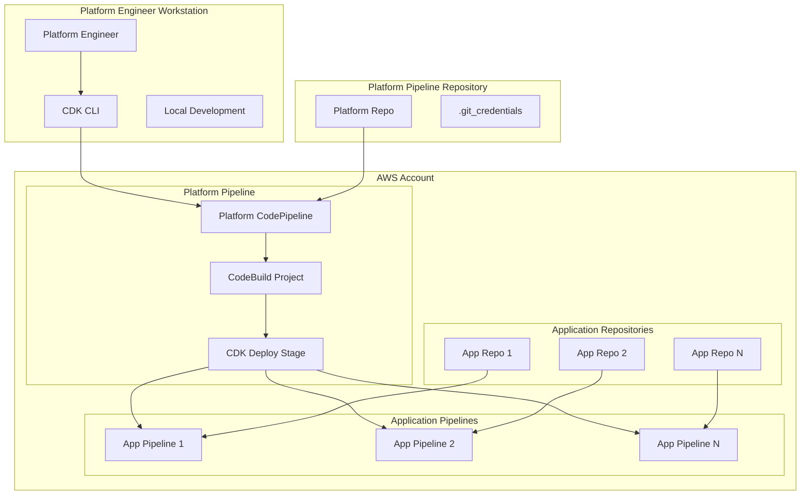

# Design Document: Platform Pipeline CDK System

## Overview

This design document outlines the architecture and implementation approach for a platform-owned CI/CD pipeline system using AWS CDK with TypeScript. The system implements a two-tier pipeline architecture where platform engineers manage a self-mutating platform pipeline that creates and controls application pipelines for various application teams.

The solution leverages AWS CDK's self-mutating pipeline capabilities to provide a robust, scalable, and maintainable CI/CD platform that enforces standardization while allowing flexibility for different application requirements.

## Architecture

### High-Level Architecture



### Component Architecture

The system consists of several key components:

1. **Platform Pipeline Stack**: Self-mutating CDK pipeline that manages its own updates
2. **Application Pipeline Factory**: CDK constructs that generate standardized application pipelines
3. **Configuration Management**: Parameter-driven pipeline configuration system
4. **Security Layer**: IAM roles, credential management, and access controls
5. **Monitoring and Observability**: CloudWatch integration for pipeline monitoring

## Components and Interfaces

### Platform Pipeline Stack

The core component that implements the self-mutating pipeline pattern using CDK Pipelines construct.

**Key Responsibilities:**
- Self-mutation capabilities for pipeline updates
- Source integration with GitHub via CodeStar connections
- Orchestration of application pipeline deployments
- Environment management and promotion

**CDK Implementation:**
```typescript
export class PlatformPipelineStack extends Stack {
  constructor(scope: Construct, id: string, props: PlatformPipelineProps) {
    super(scope, id, props);
    
    const pipeline = new CodePipeline(this, 'PlatformPipeline', {
      selfMutation: true,
      crossAccountKeys: true,
      synth: new ShellStep('Synth', {
        input: CodePipelineSource.connection(
          `${props.githubOrg}/${props.githubRepo}`, 
          props.branch,
          { connectionArn: props.connectionArn }
        ),
        commands: [
          'npm ci',
          'npm run build', 
          'npm run test',
          'npx cdk synth'
        ]
      })
    });
  }
}
```

### Application Pipeline Factory

A set of CDK constructs that create standardized application pipelines with configurable parameters.

**Key Features:**
- Parameterized source repository configuration
- Standardized build and deployment stages
- Environment-specific deployment targets
- Consistent security and monitoring patterns

**Interface:**
```typescript
export interface ApplicationPipelineConfig {
  readonly applicationName: string;
  readonly sourceRepo: {
    readonly owner: string;
    readonly repo: string;
    readonly branch: string;
  };
  readonly buildSpec?: BuildSpec;
  readonly deploymentTargets: DeploymentTarget[];
  readonly notifications?: NotificationConfig;
}

export class ApplicationPipelineConstruct extends Construct {
  constructor(scope: Construct, id: string, config: ApplicationPipelineConfig) {
    // Implementation creates CodePipeline with standardized stages
  }
}
```

### Configuration Management System

Manages pipeline configurations through CDK context and parameter files.

**Configuration Structure:**
- Global platform settings in `cdk.context.json`
- Application-specific configurations in `config/applications/`
- Environment-specific overrides in `config/environments/`

**Configuration Schema:**
```typescript
export interface PlatformConfig {
  readonly platform: {
    readonly region: string;
    readonly account: string;
    readonly connectionArn: string;
  };
  readonly applications: ApplicationPipelineConfig[];
  readonly environments: {
    [envName: string]: EnvironmentConfig;
  };
}
```

### Security and IAM Management

Implements least-privilege access patterns for both platform and application pipelines.

**Security Components:**
- Platform pipeline execution role with deployment permissions
- Application pipeline roles with scoped permissions
- Cross-account deployment roles for multi-account scenarios
- Secure credential management for GitHub integration

**IAM Role Structure:**
```typescript
export class SecurityStack extends Stack {
  public readonly platformPipelineRole: Role;
  public readonly applicationPipelineRole: Role;
  
  constructor(scope: Construct, id: string, props: SecurityStackProps) {
    // Create roles with appropriate policies
    this.platformPipelineRole = new Role(this, 'PlatformPipelineRole', {
      assumedBy: new ServicePrincipal('codepipeline.amazonaws.com'),
      managedPolicies: [
        ManagedPolicy.fromAwsManagedPolicyName('AWSCodePipelineFullAccess'),
        // Additional policies for CDK deployment
      ]
    });
  }
}
```

## Data Models

### Pipeline Configuration Model

```typescript
export interface PipelineConfiguration {
  readonly metadata: {
    readonly name: string;
    readonly version: string;
    readonly createdAt: Date;
    readonly updatedAt: Date;
  };
  readonly source: {
    readonly type: 'github' | 'codecommit';
    readonly repository: string;
    readonly branch: string;
    readonly connectionArn?: string;
  };
  readonly build: {
    readonly runtime: string;
    readonly commands: string[];
    readonly environment?: { [key: string]: string };
  };
  readonly deployment: {
    readonly stages: DeploymentStage[];
    readonly approvals?: ApprovalConfiguration[];
  };
}

export interface DeploymentStage {
  readonly name: string;
  readonly account: string;
  readonly region: string;
  readonly stackName: string;
  readonly parameters?: { [key: string]: string };
}
```

### Application Registry Model

```typescript
export interface ApplicationRegistry {
  readonly applications: {
    [applicationId: string]: {
      readonly name: string;
      readonly team: string;
      readonly repository: string;
      readonly pipelineConfig: PipelineConfiguration;
      readonly status: 'active' | 'inactive' | 'deprecated';
    };
  };
}
```

## Correctness Properties

*A property is a characteristic or behavior that should hold true across all valid executions of a system-essentially, a formal statement about what the system should do. Properties serve as the bridge between human-readable specifications and machine-verifiable correctness guarantees.*

Let me analyze the acceptance criteria to determine which ones are testable as properties:

<function_calls>
<invoke name="prework">
<parameter name="featureName">rag-platform

After reviewing the prework analysis, I'll consolidate redundant properties and focus on the most valuable correctness properties:

**Property 1: Self-mutation consistency**
*For any* valid CDK infrastructure change committed to the platform repository, the platform pipeline should successfully validate, deploy, and update itself with those changes.
**Validates: Requirements 1.2**

**Property 2: TypeScript compilation integrity**
*For any* CDK stack definition in the platform, all TypeScript code should compile successfully and all stack files should be valid TypeScript files.
**Validates: Requirements 1.3, 3.5**

**Property 3: Infrastructure as code completeness**
*For any* infrastructure component deployed by the platform, there should exist corresponding CDK code definitions in version control.
**Validates: Requirements 1.4**

**Property 4: Application pipeline deployment consistency**
*For any* platform pipeline execution, all configured application pipelines should be successfully deployed or updated using CDK.
**Validates: Requirements 2.1**

**Property 5: Configuration parameterization**
*For any* application pipeline configuration, repository URLs and environment-specific settings should be stored as parameters or context values, not hardcoded.
**Validates: Requirements 2.2, 6.1, 6.2**

**Property 6: Pipeline standardization**
*For any* application pipeline generated by the platform, it should conform to the standardized template and patterns defined by the platform.
**Validates: Requirements 2.5**

**Property 7: Local development workflow integrity**
*For any* valid CDK code, the commands `cdk diff` and `cdk synth` should execute successfully and provide meaningful output.
**Validates: Requirements 3.1, 3.2**

**Property 8: Security credential isolation**
*For any* credential file (`.git_credentials`), it should be excluded from version control and stored only locally on platform engineer workstations.
**Validates: Requirements 4.1, 4.2**

**Property 9: Secure credential access in CI/CD**
*For any* CodeBuild execution, credentials should be accessed through environment variables or AWS Secrets Manager, never hardcoded.
**Validates: Requirements 4.3**

**Property 10: IAM least privilege compliance**
*For any* IAM role created by the platform, it should implement least-privilege access patterns with only necessary permissions.
**Validates: Requirements 4.4**

**Property 11: Build environment consistency**
*For any* platform pipeline execution, the CodeBuild environment should have CDK CLI and Node.js runtime installed and TypeScript compilation should complete before deployment.
**Validates: Requirements 5.1, 5.2**

**Property 12: Configuration validation**
*For any* configuration change, the system should validate syntax and values before applying the changes.
**Validates: Requirements 6.3**

**Property 13: Monitoring and logging completeness**
*For any* pipeline execution, events should be logged to CloudWatch and metrics should be collected for execution times and success rates.
**Validates: Requirements 7.1, 7.3**

**Property 14: Failure notification reliability**
*For any* pipeline failure, notifications should be sent to platform engineers.
**Validates: Requirements 7.2**

## Error Handling

The system implements comprehensive error handling at multiple levels:

### CDK Deployment Errors
- CloudFormation rollback capabilities for failed deployments
- Clear error messaging with actionable guidance
- Automatic retry mechanisms for transient failures
- Dead letter queues for failed pipeline executions

### Configuration Validation Errors
- Schema validation for all configuration files
- Pre-deployment validation of CDK context and parameters
- Clear error messages for configuration syntax issues
- Rollback to previous known-good configuration

### Build and Compilation Errors
- TypeScript compilation error reporting
- Dependency resolution failure handling
- Build artifact validation
- Clear error propagation to platform engineers

### Security and Access Errors
- IAM permission validation before deployment
- Credential validation and rotation handling
- Cross-account access error management
- Audit trail for all security-related failures

## Testing Strategy

The testing strategy employs a dual approach combining unit tests and property-based tests to ensure comprehensive coverage:

### Unit Testing Approach
- **CDK Stack Testing**: Unit tests for individual CDK stacks using CDK assertions
- **Configuration Validation**: Tests for configuration parsing and validation logic
- **Integration Points**: Tests for GitHub integration, CodeBuild setup, and IAM role creation
- **Error Scenarios**: Specific tests for error handling and rollback scenarios

### Property-Based Testing Approach
- **Testing Framework**: Use `fast-check` library for TypeScript property-based testing
- **Test Configuration**: Minimum 100 iterations per property test
- **Property Test Coverage**: Each correctness property implemented as a separate property-based test
- **Test Tagging**: Each test tagged with format: **Feature: rag-platform, Property {number}: {property_text}**

### Testing Implementation Guidelines
- Property tests validate universal behaviors across all valid inputs
- Unit tests focus on specific examples, edge cases, and integration points
- Both testing approaches are complementary and necessary for comprehensive coverage
- Property tests use intelligent generators that constrain to valid input spaces
- All tests must reference their corresponding design document properties

### Test Environment Setup
- Local testing using CDK CLI commands (`cdk synth`, `cdk diff`)
- Isolated AWS accounts for integration testing
- Mock services for external dependencies during unit testing
- Automated test execution in CI/CD pipeline before deployment

The combination of unit and property-based testing ensures both concrete functionality validation and universal correctness guarantees across the entire system.